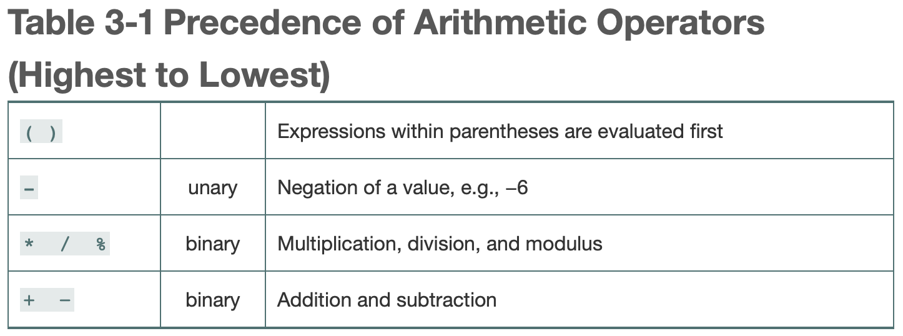

# Chapter 3: Expressions and Interactivity

## Table of Contents
  * [3.1 The `cin` Object](#31-the--cin--object)
      - [Program Output with Example Input Shown in Bold](#program-output-with-example-input-shown-in-bold)
  * [3.2 Mathematical Expressions](#32-mathematical-expressions)
  * [3.3 Data Type Conversion and Type Casting](#33-data-type-conversion-and-type-casting)

---

## 3.1 The `cin` Object

`cin` (**c**onsole **in**) can be used to read data typed at the keyboard.

*_Remember to include the_ `iostream` _header file in any program that uses_ `cout` _or_ `cin`.

The `>>` symbol is the **_stream extraction operator_**, which _extracts_ characters from the input stream so they can be used in a program. More specifically, the stream extraction operator gets characters from the stream object on its left and stores them in the variable whose name appears on its right.  

The `cin` object causes a program to wait until data is typed at the keyboard and the [Enter] key is pressed. No other lines will be executed until `cin` gets its input.

When the user enters characters from the keyboard, they are temporarily placed in an area of memory called the **_input buffer_**, or **_keyboard buffer_**. When `cin` reads them, it automatically converts them into the data type of the variable where the input data will be stored. For example, if the user types `10`, it is read as the characters `'1'` and `'0'`, but `cin` is smart enough to know this will have to be converted to the `int` value `10` before it is stored in a variable.

If a user enters a floating-point number like `10.7`, there is a problem. `cin` knows such a value cannot be stored in an `int` value, so it stops reading when it gets to the decimal point, leaving the decimal point and the rest of the digits in the input buffer.

```
cout << "Enter the length and width of the rectangle ";
cout << "separated by a space. \n";
cin >> length >> width;
```

#### Program Output with Example Input Shown in Bold
```
Enter the length and width of the rectangle separated by a space.

10 20[Enter]

The area of the rectangle is 200
```

In the example output, the user entered `10` and `20` so `10` is stored in `length` and `20` is stored in `width`.

Notice the user separates the numbers by spaces as they are entered. This is how `cin` knows where each number begins and ends. It doesn't matter how many spaces are entered between the individual numbers.

```
cout << "Enter an integer, a double, and a character";
cin >> whole >> factional >> letter;
```


## 3.2 Mathematical Expressions

C++ allows you to construct complex mathematical expressions using multiple operators and grouping symbols.

When sending an expression that includes an operator to `cout`, it is always a good idea to put parentheses around the expression. Some operators will yield unexpected results otherwise.



**Associativity** is the order in which an operator works with its operands. Associativity is either _left to right_ or _right to left_.


C++ does not have an exponent operator. Raising a number to a power requires the use of a _library function_. A **library function** is a routine that performas a specific operation.

C++ uses the `pow` function for exponents. It accepts 2 arguments: a base and a power. `pow(base, exponent)`

`pow`:
- expects floating-point arguments (`double`)
- must include the `cmath` header file
- returns a `double` value

```
double area;
area = pow(4.0, 2);
```

***arguments** are information being sent to a function.

## 3.3 Data Type Conversion and Type Casting

When an operator's operands are of different data types, C++ automatically converts them to the same data type. When it does this it follows a set of rules, and understanding these rules will help you prevent subtle errors from creeping into your programs.


*One exception to this ranking is when an `int` and a `long int` are the same size. In that case, an `unsigned int` outranks a `long int` because it can hold a higher value.

**type coercion**: the conversion of one type of object to a new object of a different type.

**promotion**: when a value is converted to a higher data type.

**demotion**: when a value is converted to a lower data type.


