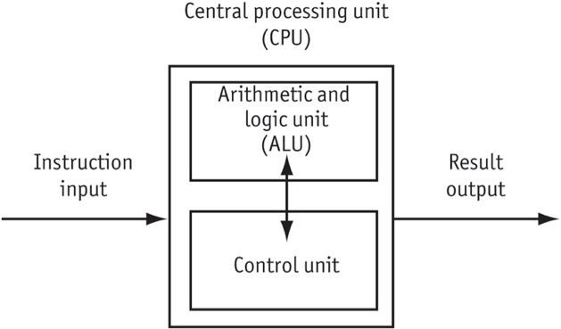

# Chapter 1: Review Q&A

**1.1 Why is the computer used by so many different people, in so many different professions?**

Computers allow users to perform calculations, tasks, and complicated jobs quickly.

**1.2 List the five major hardware components of a computer system.**

The central processing unit (CPU), main memory (random access memory, RAM), secondary storage devices (hard drives, thumb drives), input devices (keyboard, scanner, mouse), output devices (printer, speakers, monitor).

**1.3 Internally, the CPU consists of what two units?**

The Arithmetic and logic unit (ALU) and the control unit.

**1.4 Describe the steps in the fetch/decode/execute cycle.** 

| **Step**   | Description |
| ----------- | ------------------------------------------------------------ |
| **Fetch**   | The CPU’s control unit fetches, from main memory, the next instruction in the sequence of program instructions. |
| **Decode**  | The instruction is encoded in the form of a number. The control unit decodes the instruction and generates an electronic signal. |
| **Execute** | The signal is routed to the appropriate component of the computer (such as the ALU, a disk drive, or some other device). The signal causes the component to perform an operation. |

**1.5 What is a memory address? What is its purpose?**

A memory address is a number assigned to a byte representing its location in memory. Memory is divided into cells, each of which has a number ID, or an address.

**1.6 Explain why computers have both main memory and secondary storage.**

Main memory is working memory while secondary storage is persistent, long-term. Main memory is temporary and erased when the machine is off. 

**1.7 What are two general categories of software?**

System software and application software.

**1.8 What fundamental set of programs controls the internal operations of the computer's hardware?**

An operating system (OS).

**1.9 What do you call a program that performs a specialized task, such as a virus scanner, a file-compression program, or a data-backup program?**

A utility program.

**1.10 Word processing programs, spreadsheet programs, e-mail programs, Web browsers, and game programs belong to what category of software?**

Application software.

**1.11 What is an algorithm?**

A set of instructions to solve a problem or perform a task.

**1.12 Why were computer programming languages invented?**

To make programming easier. Writing binary would be frustrating.

**1.13 What is the difference between a high-level language and a low-level language?**

High-level languages are easier to read. Low-level languages are closer to machine code, which is basically binary.

**1.14 What does portability mean?**

A portable program is one that can be written on one computer and run on other types of systems. They will likely need to be compiled differently but the program itself needs little or no change.

**1.15 Explain the operations carried out by the preprocessor, compiler, and linker.**

The preprocessor is a program that reads the source code and searches for directives that cause it to amend or process the code in a certain way. The compiler takes the preprocessed code and translates it to machine code (object code). Should there be any syntactical errors, the compiler will fail. The output of the compiler is an object file. The linker is a program that takes the object file and combines it with any necessary runtime library routines. Its output is an executable file.

**1.16 Explain what is stored in a source file, an object file, and an executable file.**

A **source file** contains source code (pre-preprocessor), an **object file** contains object code (post-preprocessor & compiler), and an **executable file** contains executable code (post-linker; final output). 

**1.17 What is an integrated development environment?**

An IDE is software that includes a text editor, a compiler, debugger and other utilities. An example is Microsoft Visual Studio Code (VSCode).
